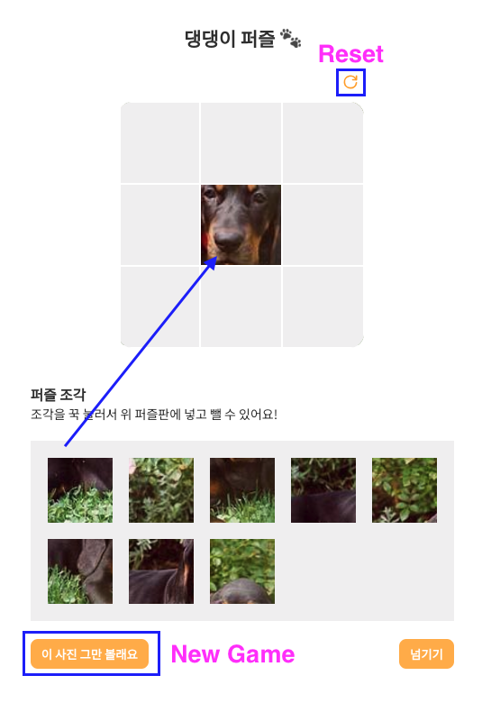

# 댕댕이 퍼즐
https://siennapp.github.io/daeng-puzzle
## 프로젝트 설명

- 아래 퍼즐 조각을 퍼즐판 위로 드래그 앤 드롭이 가능합니다. 퍼즐판이 아닌 위치에 드롭하거나 이미 퍼즐판에 퍼즐조각이 있을 시 원래 자리로 돌아갑니다
- **Reset** 클릭시 모든 퍼즐판의 모든 조각이 원래 자리로 돌아갑니다.
- 항목의 내용 **New Game**을 클릭할 시 새로운 사진의 퍼즐이 로드 됩니다. 

## 프로젝트 실행 방법

`git clone` 후, `npm install & npm start` 명령어를 통해서 실행하세요.

## 

프로젝트에서 사용한 라이브러리와 API정보는 다음과 같습니다.

- React , typescirpt
- Styled Components
- 강아지 사진 API : [https://dog.ceo/dog-api/](https://dog.ceo/dog-api/)
